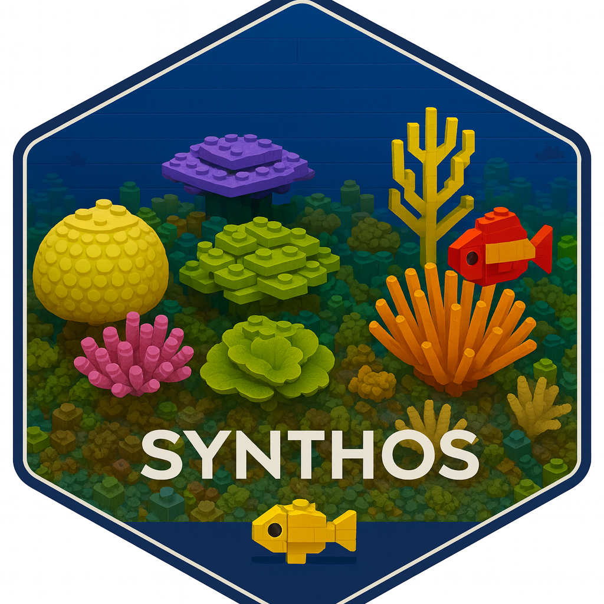

=========================================================================================

[](https://github.com/open-AIMS/synthos/actions/workflows/pkgdown.yaml)

**`synthos` is an R package to generate synthetic data.**

The `synthos` package provides a simple interface to generate synthetic data for ecological communities. BLABLABLA

The `synthos` package combines features from the [`sf`](https://r-spatial.github.io/sf/) and [`stars`](https://r-spatial.github.io/stars/) packages for spatial data processing; and, [`R-INLA`](https://www.r-inla.org/) and [`gstat`](https://r-spatial.github.io/gstat/) for geostatistical models.

Using the package
-------------------

**You can install the latest  version of the synthos package:**

```remotes::install_github("open-AIMS/synthos@julie")```

Usage and further information about `synthos` can be seen on the [project page](https://open-aims.github.io/synthos/) and the [vignettes](https://open-aims.github.io/synthos/articles/). Help files for the individual functions can be found on the [reference page](https://open-aims.github.io/synthos/reference/).


Further Information
-------------------

`synthos` is provided by the [Australian Institute of Marine
Science](https://www.aims.gov.au/) under the GPL-2 License
([GPL-2](https://opensource.org/license/gpl-2-0)).

<!-- ## Package workflow

A typical MBG workflow includes the following steps:

1. Load point data on **outcomes**, raster **covariate surfaces**, and a raster **population surface**
2. _(Optional):_ Run **machine learning models** relating the input covariate surfaces to the outcome, producing predictive raster surfaces from a variety of methods
3. **Prepare inputs** for the geostatistical model. This includes the outcomes point data, model specifications, a spatial 2-D mesh, and either the input covariate surfaces or the ML predictive surfaces
4. Run the **geostatistical model**. This model predicts the outcome as a linear combination of the raster surfaces and a SPDE approximation to a Gaussian process over space.
5. Using the model fit, **generate gridded predictions** of the outcome across the entire study area. Uncertainty is captured by generating 250 posterior predictive draws at each pixel location.
6. **Summarize predictive draws** as raster surfaces by taking the mean, median, and 95% uncertainty interval bounds of draws at each pixel location
7. _(Optional):_ **Aggregate** from pixels to administrative boundaries, preserving uncertainty

For more details, see the [introductory vignette](https://henryspatialanalysis.github.io/mbg/articles/mbg.html).

---

### Acknowledgments

Many thanks to the following groups of people for their contributions to the package:

- IHME's Local Burden of Disease core code team, for their development of geostatistical software tools that helped inspire this package. Special thanks to Aaron Osgood-Zimmerman, Ian Davis, John VanderHeide, Jon Mosser, Katie Wilson, Lauren Woyczynski, Michael Collison, Michael Cork, Mike Richards, Nafis Sadat, Neal Marquez, and Roy Burstein.
- The Geospatial Analysis team at the Demographic and Health Surveys Program -->
<!-- 
# Installation

```
git clone git@github.com:open-AIMS/synthos.git .
```

# Example use

The following describe how to use some of the wrapper functions to
generate synthetic fixed photo-transect and quadrats data.

## Create synthetic reef landscape

```
library(sf)
library(stars)
library(gstat)
library(INLA)
library(synthos)
config <- list(
  seed = 1,
  crs = 4326,
  model = "Exp",
  psill = 1,
  range = 15,
  nugget = 0,
  alpha = 2,
  kappa = 1,
  variance = 1,
  patch_threshold = 1.75,
  reef_width = 0.01,
  years = 1:12,
  dhw_weight = 0.5,
  cyc_weight = 0.4,
  other_weight = 0.1,
  hcc_cover_range = c(0.1, 0.7),
  hcc_growth = 0.3,
  sc_cover_range = c(0.01, 0.1),
  sc_growth =  0.3
)
spatial_domain <- st_geometry(
  st_multipoint(
    x = rbind(
      c(0, -10),
      c(3, -10),
      c(10, -20),
      c(1, -21),
      c(2, -16),
      c(0, -10)
    )
  )
) |>
  st_set_crs(config$crs) |>
  st_cast("POLYGON")
set.seed(config$seed)
spatial_grid <- spatial_domain |>
  st_set_crs(NA) |>
  st_sample(size = 10000, type = "regular") |>
  st_set_crs(config$crs)
sf_use_s2(FALSE)
benthos_reefs_pts <- create_synthetic_reef_landscape(spatial_grid, config)
```

## Generate large scale fixed design

```
config <- list(n_locs = 25, n_sites = 2, seed = 123)
benthos_fixed_locs_sf <- sampling_design_large_scale_fixed(benthos_reefs_pts, config)
```

## Generate fine scale fixed design

```
config <- list(
  years =  1:12,
  Number_of_transects_per_site = 5,
  Depths = 2,
  Number_of_frames_per_transect = 100,
  Points_per_frame = 5,
  ## Note, the following are on the link scale
  hcc_site_sigma = 0.5, # variability in Sites within Locations
  hcc_transect_sigma = 0.2, # variability in Transects within Sites
  hcc_sigma = 0.1, # random noise

  sc_site_sigma = 0.05, # variability in Sites within Locations
  sc_transect_sigma = 0.02, # variability in Transects within Sites
  sc_sigma = 0.01, # random noise

  ma_site_sigma = 0.5, # variability in Sites within Locations
  ma_transect_sigma = 0.2, # variability in Transects within Sites
  ma_sigma = 0.1 # random noise
)

benthos_fixed_locs_obs <- sampling_design_fine_scale_fixed(benthos_fixed_locs_sf, config)
```

## Generate photo-transect like data and prepare for reefCloud
```
config <- list(
  Depths = 2,
  Depth_effect_multiplier = 2,
  Number_of_transects_per_site = 5,
  Number_of_frames_per_transect = 100,
  Points_per_frame = 5
)
benthos_fixed_locs_points <- sampling_design_fine_scale_points(benthos_fixed_locs_obs, config)

reefcloud_synthetic_fixed_benthos <- prepare_for_reefcloud(benthos_fixed_locs_points)
```

## Generate quadrat-like (percent cover) data and prepare for reefCloud

```
config <- list(
  Depths = 2,
  Depth_effect_multiplier = 2,
  Number_of_transects_per_site = 5,
  Number_of_quadrats_per_transect = 10,
  Quad_sigma = 0.5
)
benthos_fixed_locs_cover <- sampling_design_fine_scale_cover(benthos_fixed_locs_obs, config)

reefcloud_synthetic_fixed_benthos_cover <- prepare_for_reefcloud(benthos_fixed_locs_cover)
``` -->
