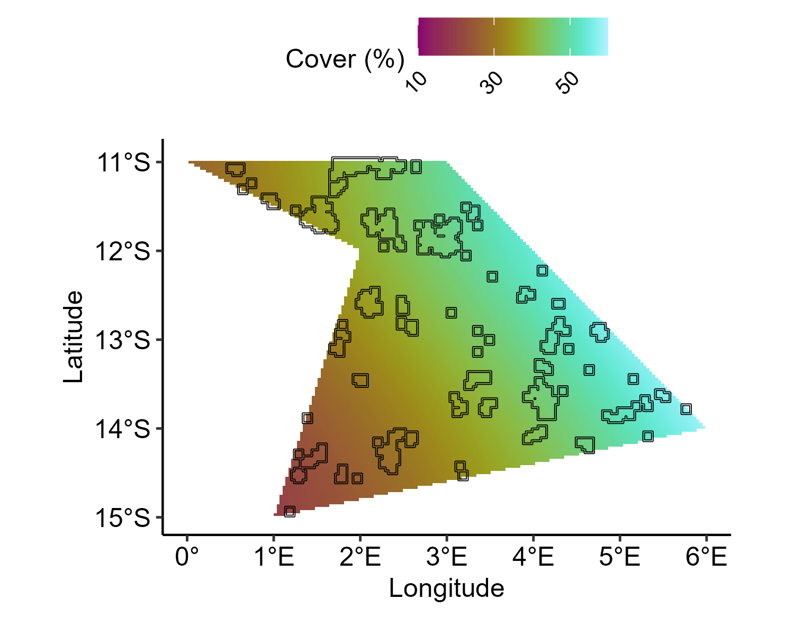
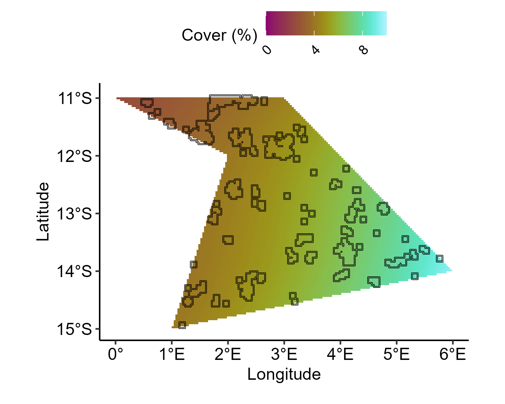

# Generate baselines

## Setting up

``` r
# Load packages
library(sf)
library(stars)
library(gstat)
library(INLA)
library(ggplot2)
library(synthos)
library(stringr)
library(ggpubr)
library(scico)
```

## 1. Generate settings

``` r
surveys <-  "random" # or  "fixed"
data_type <- "points" # or "cover"

synthos::generateSettings(nreefs = 25, nsites = 3, nyears = 15)
```

## 2. Generate the baseline for hard corals

``` r

## ---- SyntheticData_Spatial.mesh
mesh <- synthos::create_spde_mesh(spatial_grid,config_sp)

## Synthetic Baselines ----------------------------------------------------
spatial.grid.pts.df <- spatial_grid %>%
  st_coordinates() %>%
  as.data.frame() %>%
  dplyr::rename(Longitude = X, Latitude = Y) %>%
  arrange(Longitude, Latitude)

## ---- SyntheticData_BaselineSpatial.HCC
baseline.sample.hcc <- mesh$loc[,1:2] %>%
  as.data.frame() %>%
  dplyr::select(Longitude = V1, Latitude = V2) %>%
  mutate(clong = as.vector(scale(Longitude, scale = FALSE)),
         clat = as.vector(scale(Latitude, scale = FALSE)),
         Y = clong + sin(clat) + 
           1.5*clong + clat) %>%
  mutate(Y = scales::rescale(Y, to = c(-2, 0.8)))

baseline.effects.hcc <- baseline.sample.hcc %>%
  dplyr::select(Y) %>%
  as.matrix
baseline.pts.sample.hcc <- inla.mesh.project(mesh,
                                             loc=as.matrix(spatial.grid.pts.df [,1:2]),
                                             baseline.effects.hcc)
baseline.pts.effects.hcc = baseline.pts.sample.hcc %>% 
  cbind() %>% 
  as.matrix() %>% 
  as.data.frame() %>%
  cbind(spatial.grid.pts.df ) %>% 
  pivot_longer(cols = c(-Longitude,-Latitude),
               names_to = c('Year'),
               names_pattern = 'sample:(.*)',
               values_to = 'Value') %>%
  mutate(Year = as.numeric(Year))

ggplot() +
  geom_tile(
    data = baseline.pts.effects.hcc, 
    aes(y = Latitude, x = Longitude, fill = 100 * plogis(Value))
  ) +
  geom_sf(
    data = reefs.sf$simulated_reefs_sf, 
    fill = NA, 
    color = "black"
  ) +
  scico::scale_fill_scico(
    "Coral cover (%)",
    palette = "hawaii",      
    direction = 1,
    limits = c(10, 60),        
    breaks = seq(10, 60, by = 20),
    labels = scales::number_format(accuracy = 1)
  ) +
  coord_sf(crs = 4326) +
  xlab("Longitude") + 
  ylab("Latitude") +
  theme_pubr() +
  theme(
    legend.position = "top",
    legend.justification = c(0.5, 1),
    legend.direction = "horizontal",
    legend.text = element_text(angle = 45, hjust = 1)
  )
```



Figure 1: Baseline values for hard corals.

## 3. Generate the baseline for soft corals

``` r
baseline.sample.sc <- mesh$loc[, 1:2] %>%
  as.data.frame() %>%
  dplyr::select(Longitude = V1, Latitude = V2) %>%
  mutate(
    clong = as.vector(scale(Longitude, scale = FALSE)),
    clat = as.vector(scale(Latitude, scale = FALSE)),
    Y = clong + sin(clat) +
      1.5 * clong + -1.5 * clat
  ) %>%
  mutate(Y = scales::rescale(Y, to = c(-4, -2)))

baseline.effects.sc <- baseline.sample.sc %>%
  dplyr::select(Y) %>%
  as.matrix()
baseline.pts.sample.sc <- inla.mesh.project(mesh,
  loc = as.matrix(spatial.grid.pts.df [, 1:2]),
  baseline.effects.sc
)
baseline.pts.effects.sc <- baseline.pts.sample.sc %>%
  cbind() %>%
  as.matrix() %>%
  as.data.frame() %>%
  cbind(spatial.grid.pts.df) %>%
  pivot_longer(
    cols = c(-Longitude, -Latitude),
    names_to = c("Year"),
    names_pattern = "sample:(.*)",
    values_to = "Value"
  ) %>%
  mutate(Year = as.numeric(Year))

ggplot() +
  geom_tile(
    data = baseline.pts.effects.sc, 
    aes(y = Latitude, x = Longitude, fill = 100 * plogis(Value))
  ) +
  geom_sf(
    data = reefs.sf$simulated_reefs_sf, 
    fill = NA, 
    color = "black"
  ) +
  scico::scale_fill_scico(
    "Cover (%)",
    palette = "hawaii",      
    direction = 1,
    limits = c(0, 10),        
    breaks = seq(0, 10, by = 4),
    labels = scales::number_format(accuracy = 1)
  ) +
  coord_sf(crs = 4326) +
  xlab("Longitude") + 
  ylab("Latitude") +
  theme_pubr() +
  theme(
    legend.position = "top",
    legend.justification = c(0.5, 1),
    legend.direction = "horizontal",
    legend.text = element_text(angle = 45, hjust = 1)
  )
```



Figure 2: Baseline values for soft corals.
