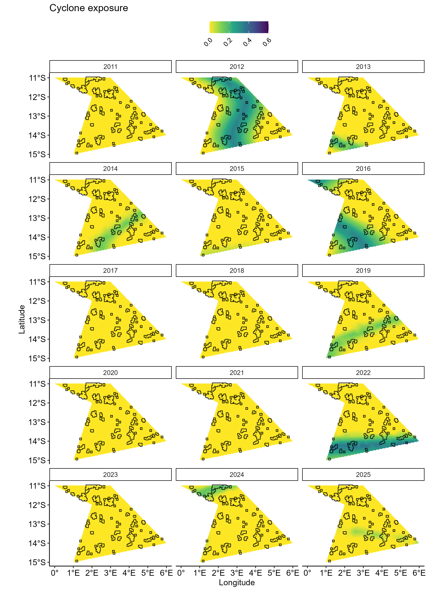
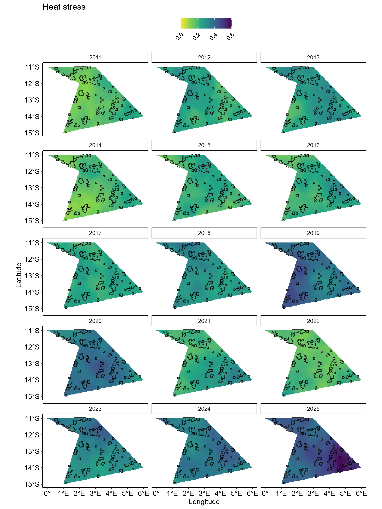
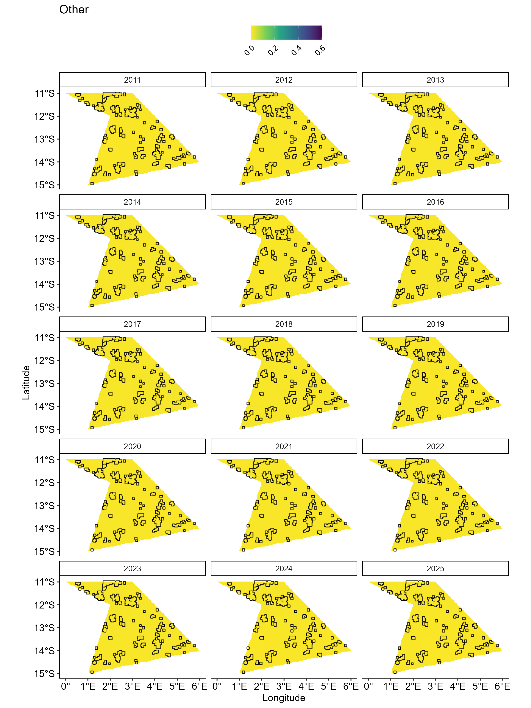

# Generate disturbances

**Details on disturbances**

`synthos` generates three types of disturbances known to reduce hard and
soft coral cover. Each disturbance has its own spatial and temporal
patterns, reflecting how these processes occur in reality.

The intensity of a *Heat stress* event is approximated by the
distribution of Degree Heating Weeks (DHWs) with maximum annual values
correlated with mass coral bleaching and mortality. `synthos` modelled
heat stress by first generating a temporal DHW signal that varies form
year to year. Random values are then added to the trend to mimic the
yearly variation of heat-stress events under long-term warming. The
resulting temporal signal is then propagated across the spatial field
using a time-varying AR(1)-like process and rescaled between \[0-1\] to
support comparisons with other disturbances.

Exposure to *Cyclones* is modelled through three components:

- their occurrence
- their intensity
- the geographical effect: reflecting the fact that some locations are
  more susceptible to cyclone exposure than others

Cyclone occurrence in a given year is simulated as a binary event
(yes/no) whose probability of happening increases through time. When a
cyclone occurs, its intensity is also randomly generated from a
probability distribution biased to produce stronger cyclone events on
average. Values of cyclone intensity is then used to adjust the
geographical effect to produce the fine spatial pattern of cyclone
impact and rescaled between \[0-1\].

A third disturbance, *Other*, is generated using the same approach as
heat stress disturbance but without the underlying temporal trend. Each
year, spatial effects are drawn from a probability distribution
parameterized to introduce low temporal autocorrelation values between
consecutive years and rescaled between \[0-1\].

**Details on the weighting system**

Working with synthetic data requires the ability to recover the input
values, including the effects of disturbances. Although disturbances are
generated using both deterministic and stochastic processes, their
influence can be controlled by applying weights. In `synthos`,
disturbance values are scaled by user-defined deterministic weights,
providing a simple and transparent way to modulate their impact. The
configuration of the weights can be adjusted within the function
[generateSettings](https://open-aims.github.io/synthos/reference/generateSettings.html).

## Setting up

``` r
# Load packages
library(sf)
library(stars)
library(gstat)
library(INLA)
library(ggplot2)
library(synthos)
library(stringr)
library(ggpubr)
library(scico)
```

## 1. Generate settings

``` r
surveys <-  "random" # or  "fixed"
data_type <- "points" # or "cover"

synthos::generateSettings(nreefs = 25, nsites = 3, nyears = 15, dhw_eff = 0.5, cyc_eff = 0.3, other_eff = 0.2)
```

## 1. Generate disturbances

``` r

spde <- synthos:::create_spde(spatial_grid, config_sp)

######### DHW 
dhw.pts.effects.df <- synthos:::disturbance_dhw(spatial_grid, spde, config_sp)$dhw_pts_effects_df %>%
                      mutate(Dist = "DHW") %>%
                      mutate(weight = config_sp$dhw_weight)
######### CYC
cyc.pts.effects <- synthos:::disturbance_cyc(spatial_grid, spde, config_sp)$cyc_pts_effects%>%
                      mutate(Dist = "CYC") %>%
                      mutate(weight = config_sp$cyc_weight)
########## OT
other.pts.effects <- synthos:::disturbance_other(spatial_grid, spde, config_sp)$other_pts_effects%>%
                      mutate(Dist = "OT")  %>%
                      mutate(weight = config_sp$other_weight)

########## All
all.pts.effects <- bind_rows(dhw.pts.effects.df, cyc.pts.effects, other.pts.effects) %>%
                      mutate(Value_weighted = Value * weight) %>%
                      arrange(Dist) %>%
                      mutate(Dist_plot = case_when(Dist == "DHW" ~ "Heat stress",
                                                   Dist == "CYC" ~ "Cyclone exposure",
                                                   Dist == "OT" ~ "Other")) %>%
                       dplyr::mutate(Year = as.numeric(format(Sys.Date(), "%Y")) - max(config_fine$years) + Year)
```

## 2. Vizualisation

``` r
effects_by_dist <- all.pts.effects %>%
  group_split(Dist)  

dist_levels <- all.pts.effects %>% distinct(Dist_plot) %>% pull(Dist_plot)

plots_by_dist <- map2(
  effects_by_dist,
  dist_levels,
  ~ ggplot() +  
      geom_tile(data = .x, aes(x = Longitude, y = Latitude, fill = Value_weighted)) +
      geom_sf(data = reefs.sf$simulated_reefs_sf, fill = NA, color = "black") +
      facet_wrap(~Year, ncol = 3)  +
      scale_fill_viridis_c(
        name = "",
        option = "viridis",
        direction = -1,
        na.value = "grey90",
        limits = c(0, 0.6),
        breaks = seq(0, 0.6, by = 0.2),
        labels = scales::number_format(accuracy = 0.1)
      ) +
      coord_sf(crs = 4326) +
      ggtitle(.y) +
      xlab("Longitude") +
      ylab("Latitude") +
      theme_pubr() +
      theme(
        legend.position = "top",
        legend.justification = c(0.5, 1),
        legend.direction = "horizontal",
        legend.text = element_text(angle = 45, hjust = 1),
        strip.background = element_rect(fill = 'white')
      )
)
```



Figure 1: Modelled relative and weighted exposure to cyclone across
surveyed years.



Figure 2: Modelled relative and weighted heat stress across surveyed
years.



Figure 3: Modelled relative and weighted other disturbances across
surveyed years.
