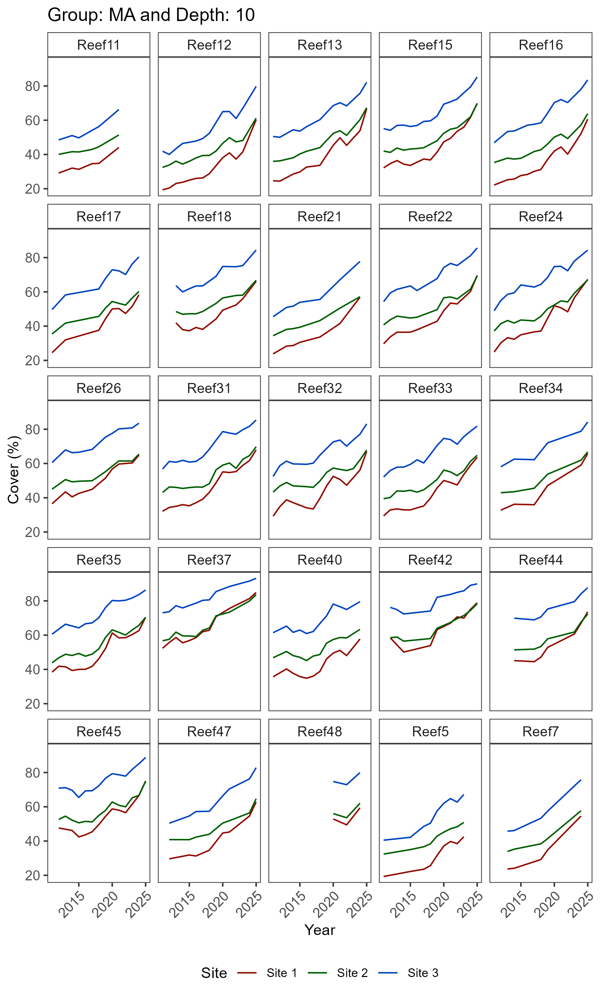
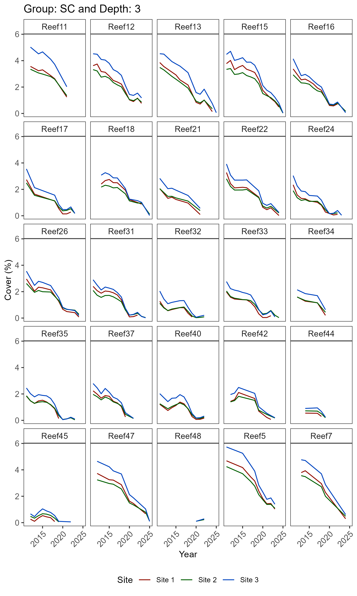
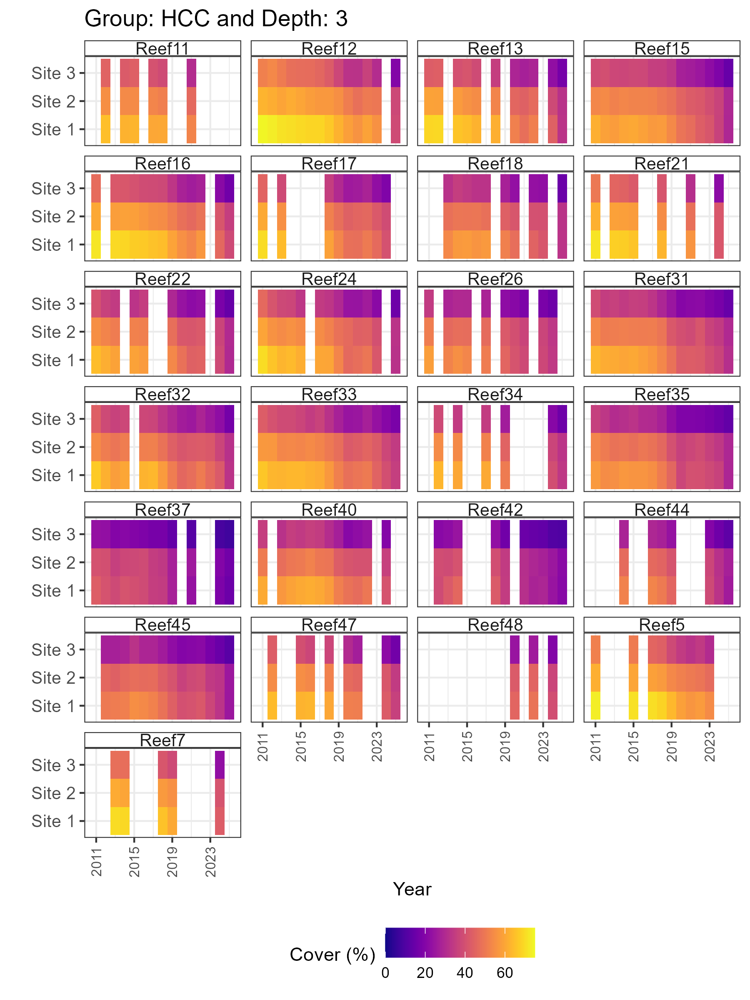
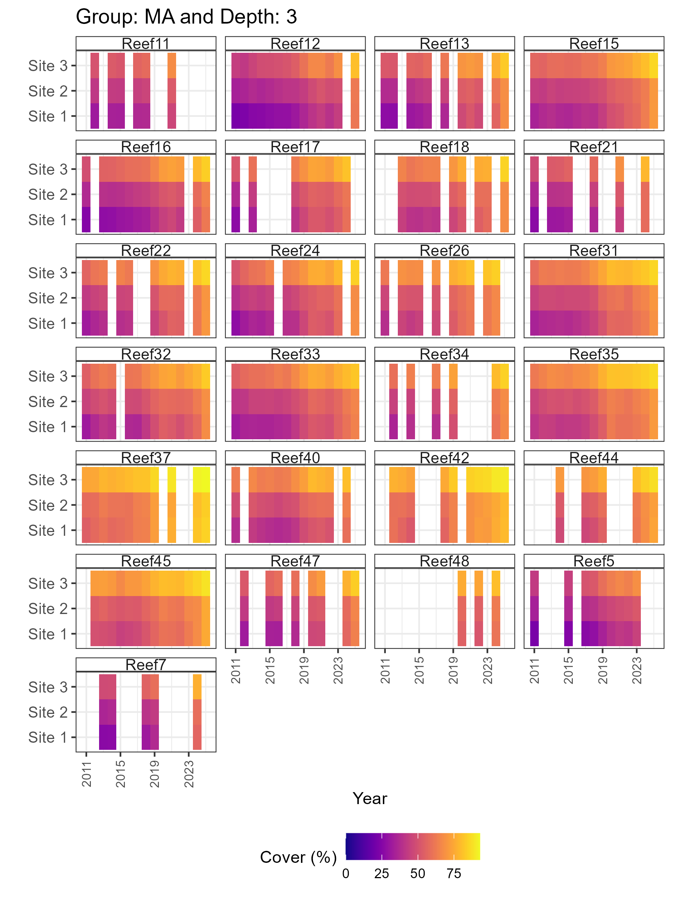

# Generate synthos data

## Setting up

``` r
# Load packages
library(sf)
library(stars)
library(gstat)
library(INLA)
library(ggplot2)
library(synthos)
```

## 1. Generate settings

``` r
surveys <-  "random" # or  "fixed"
data_type <- "points" # or "cover"

synthos::generateSettings(nreefs = 25, nsites = 3, nyears = 15)
```

## 2. Generate the spatio-temporal domain, disturbance effects and baselines

``` r
spatial_domain <- st_geometry(
  st_multipoint(
    x = rbind(
      c(0, -11),
      c(3,-11),
      c(6,-14),
      c(1,-15),
      c(2,-12),
      c(0,-11)
    )
  )
) |>
  st_set_crs(config_sp$crs) |>
  st_cast("POLYGON")

## ---- SpatialPoints
set.seed(config_sp$seed)
spatial_grid <- spatial_domain |>
  st_set_crs(NA) |>
  st_sample(size = 10000, type = "regular") |>
  st_set_crs(config_sp$crs)
sf_use_s2(FALSE)

benthos_reefs_pts <- synthos::create_synthetic_reef_landscape(spatial_grid, config_sp)
```

## 3. Generate sampling design

``` r
if (surveys == "fixed") {
  locs_sf <- synthos::sampling_design_large_scale_fixed(
    benthos_reefs_pts, config_lrge
  )
  obs <- synthos::sampling_design_fine_scale_fixed(
    locs_sf, config_fine
  )
  
} else if (surveys == "random") {
  locs_sf <- synthos::sampling_design_large_scale_random(
    benthos_reefs_pts, config_lrge
  )
  obs <- synthos::sampling_design_fine_scale_random(
    locs_sf, config_fine
  )
} else {
  stop("surveys must be 'fixed' or 'random'.")
}
```

## 4. Generate export data table

``` r
if (data_type == "points") {
  pts <- synthos::sampling_design_fine_scale_points(obs, config_pt)
  synthos_data <- synthos::prepare_table(pts)  
  
} else if (data_type == "cover") {
  cov <- synthos::sampling_design_fine_scale_cover(obs, config_pt)
  synthos_data <- synthos::prepare_table(cov) 
  
} else {
  stop("data_type must be 'points' or 'cover'.")
}
```

## 5. Vizualisations

``` r
# 3.1 Long-term trajectories at site level

plots_1 <- synthos::plot_synthos(synthos_data, type = "trajectories")
purrr::walk(seq_along(plots), ~ ggsave(filename = paste0("figures/figure1.", .x, ".png"),
                                plot = plots[[.x]], width = 6, height = 10, dpi = 300))

# 3.2 Heatmaps 
plots_2 <- synthos::plot_synthos(synthos_data, type = "heatmaps")
purrr::walk(seq_along(plots), ~ ggsave(filename = paste0("figures/figure2.", .x, ".png"),
                                plot = plots[[.x]], width = 6, height = 8, dpi = 300))
```

### 5.1 Trajectories


Figure 1: Trajectories of hard coral cover (HCC) at 3m depth.


Figure 2: Trajectories of hard coral cover (HCC) at 10m depth.


Figure 3: Trajectories of macroalgae cover (MA) at 3m depth.



Figure 4: Trajectories of macroalgae cover (MA) at 10m depth.



Figure 5: Trajectories of soft coral cover (SC) at 3m depth.


Figure 6: Trajectories of soft coral cover (SC) at 10m depth.

### 5.2 Heatmaps



Figure 7: Temporal pattern of mean hard coral cover (HCC) by site at 3m
depth.


Figure 8: Temporal pattern of mean hard coral cover (HCC) by site at 10m
depth.



Figure 9: Temporal pattern of mean macroalgae cover (MA) by site at 3m
depth.


Figure 10: Temporal pattern of mean macroalgae cover (MA) by site at 10m
depth.


Figure 11: Temporal pattern of mean soft coral cover (SC) by site at 3m
depth.


Figure 12: Temporal pattern of mean soft coral cover (SC) by site at 10m
depth.
