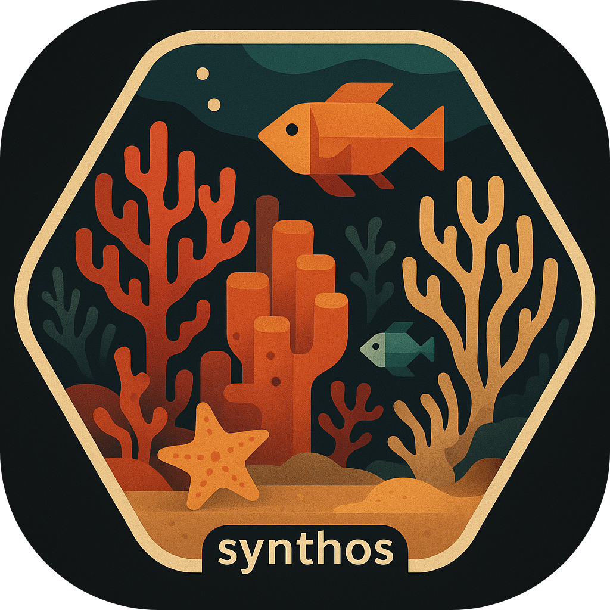

# synthos 

**`synthos` is an R package to generate synthetic data.**

The `synthos` package provides an interface to generate semi-realistic
synthetic abundance data. It leverages spatio-temporal dependencies to
simulate the underlying deterministic and stochastic processes
responsible for fluctuations in ecological community abundance that are
recorded through monitoring surveys.

In this first version, `synthos` generates observations for three
habitat-forming benthic communities commonly found on tropical coral
reefs - hard coral, soft coral, and macroalgae. Their cover varies in
response to disturbances and annual growth that reduce or promote their
abundance. Different types of disturbances are generated using
deterministic processes representing their spatio-temporal footprints.

The users control the influence of disturbances with a weighting system
and the monitoring sampling design. `synthos` simulates fixed and random
monitoring locations as well as point-based or percentage cover data
types. More details of each step are provided in the
[vignettes](https://open-aims.github.io/synthos/articles/).

The `synthos` workflow consists of five main steps:

1.  Generate the spatial and temporal domains – Define the area of
    interest, including the shape, extent, and spatial structure of the
    ecosystem.
2.  Generate disturbances – Specify and simulate disturbance regimes
    that drive annual changes in community abundance.
3.  Generate ecological baselines – Create baseline spatial patterns of
    ecological communities for the year preceding sampling.
4.  Generate sampling designs – Define site allocation and hierarchical
    sampling structures.
5.  Generate observation data – Choose the type of monitoring data to
    simulate, such as point-based observations or percentage cover.

The `synthos` package combines features from the
[`sf`](https://r-spatial.github.io/sf/) and
[`stars`](https://r-spatial.github.io/stars/) packages for spatial data
processing; and, [`R-INLA`](https://www.r-inla.org/) and
[`gstat`](https://r-spatial.github.io/gstat/) for geostatistical models.

## Using the package

**You can install the latest version of the synthos package:**

`remotes::install_github("open-AIMS/synthos@julie")`

Usage and further information about `synthos` can be seen on the
[project page](https://open-aims.github.io/synthos/) and the
[vignettes](https://open-aims.github.io/synthos/articles/). Help files
for the individual functions can be found on the [reference
page](https://open-aims.github.io/synthos/reference/).

## Further Information

`synthos` is provided by the [Australian Institute of Marine
Science](https://www.aims.gov.au/) under the GPL-2 License
([GPL-2](https://opensource.org/license/gpl-2-0)).
