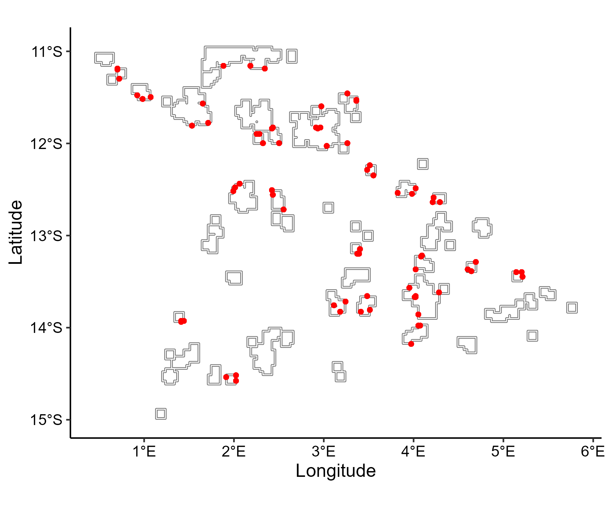

The final step is to generate the sampling design that underpins the monitoring program. In `synthos`, the design parameters are organised into two complementary components: 

- Large-scale design: defines which reefs and sites are selected across the spatial domain  
- Fine-scale design: specifies the sampling hierarchy within each site, including transects, photo frames, and points for point-based data, as well as quadrats for cover data.

Both components can be easily customised through the function [generateSettings](https://open-aims.github.io/synthos/reference/generateSettings.html), allowing users to tailor the sampling design to their specific monitoring aspirations. 


```{r, include = FALSE}
knitr::opts_chunk$set(
  collapse = TRUE,
  comment = "#>"
)
```


## Setting up

```{r setup, message = FALSE, warning = FALSE, eval=FALSE}
# Load packages
library(sf)
library(stars)
library(gstat)
library(INLA)
library(ggplot2)
library(synthos)
library(stringr)
library(ggpubr)
library(scico)
```

## 1. Generate settings 

```{r generate-settings, message = FALSE, warning = FALSE, eval=FALSE}
surveys <-  "random" # or  "fixed"
data_type <- "points" # or "cover"

synthos::generateSettings(nreefs = 25, nsites = 3, nyears = 15)
```

## 2. Generate sampling design

```{r generate-sd, message = FALSE, warning = FALSE, eval=FALSE}

benthos_reefs_pts <- synthos::create_synthetic_reef_landscape(spatial_grid, config_sp)

if (surveys == "fixed") {
  locs_sf <- synthos::sampling_design_large_scale_fixed(
    benthos_reefs_pts, config_lrge
  )
  obs <- synthos::sampling_design_fine_scale_fixed(
    locs_sf, config_fine
  )
  
} else if (surveys == "random") {
  locs_sf <- synthos::sampling_design_large_scale_random(
    benthos_reefs_pts, config_lrge
  )
  obs <- synthos::sampling_design_fine_scale_random(
    locs_sf, config_fine
  )
} else {
  stop("surveys must be 'fixed' or 'random'.")
}


if (data_type == "points") {
  pts <- synthos::sampling_design_fine_scale_points(obs, config_pt)
  synthos_data <- synthos::prepare_table(pts)  
  
} else if (data_type == "cover") {
  cov <- synthos::sampling_design_fine_scale_cover(obs, config_pt)
  synthos_data <- synthos::prepare_table(cov) 
  
} else {
  stop("data_type must be 'points' or 'cover'.")
}
```

## 3. Vizualisation

```{r generate-viz, message = FALSE, warning = FALSE, eval=FALSE}
X_sf <- synthos_data %>%
  filter(!is.na(COUNT)) %>%
  st_as_sf(coords = c("site_longitude", "site_latitude"),
           crs = st_crs(4326))

ggplot() + 
  geom_sf(data = reefs.sf$simulated_reefs_sf, fill = "gray95") + 
  geom_sf(data = X_sf, col = "red", size = 1.2) +
  xlab("Longitude") + ylab("Latitude")  +
  coord_sf(crs = 4326) +
  theme_pubr() +
  theme(
    axis.title = element_text(size = 13),
    axis.text = element_text(size = 11)
  )
```

<figure style="text-align: center">
  
  <figcaption>Figure 1: Locations of the surveyed reefs.  </figcaption>
</figure>
