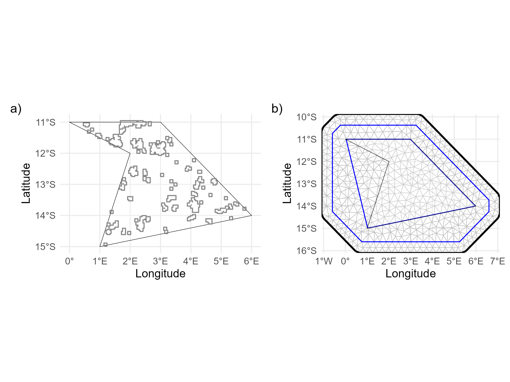

The first version of `synthos` focuses on simulating abundance data for benthic communities living on coral reefs. To generate realistic reef structures, we create a collection of irregular, non-uniformly distributed across the spatial domain using on a Gaussian Markov random field. To further enhance realism, the shapes are hollowed out to represent a shallow, sand filled lagoon surrounded by a sloping escarpment of hard substrate. Benthic communities are then constrained to grow within this reef area representing a reef slope habitat. 

```{r, include = FALSE}
knitr::opts_chunk$set(
  collapse = TRUE,
  comment = "#>"
)
```

## Setting up

```{r setup, message = FALSE, warning = FALSE, eval=FALSE}
# Load packages
library(sf)
library(stars)
library(gstat)
library(INLA)
library(ggplot2)
library(synthos)
library(stringr)
library(ggpubr)
library(scico)
```

## 1. Generate settings 

**Selection of site allocation:**
 
Two choices are available for site allocation. 

*Fixed* surveys refer to permanent monitoring locations that are revisited annually. 
This design offers greater power for detecting temporal trends, but the estimated trend values can be biased toward the specific locations chosen for sampling. 

*Random* surveys refer to monitoring locations selected without spatial permanence. Each reef is surveyed between 2 and 15 times, with the timing of sampling events separated by less than 5 years between consecutive surveys (see [sample_years_with_condition()](https://open-aims.github.io/synthos/reference/sample_years_with_condition.html) to change these conditions). This design is provide more accurate estimates of the absolute value of the response, but it may have lower statistical power for detecting temporal trends.     

**Selection of observation data type.**

Observation data type refers to the form of the measured response representing the two-dimensional coverage of a benthic community. In the first version of `synthos`, two observation types are available.

*Point-based* data corresponds to the outputs typically produced by machine-learning (ML) methods. Under this approach, abundance is expressed as the relative count of classified points per photo frame. Counts for each benthic group can then be aggregated across spatial scales; in our example, point counts are summed at the transect level. The proportion of points belonging to a given community, divided by the total number of points, provides its percent cover.

The second observation type is direct *percent cover*, which measures the area occupied by a community within a quadrat. Percent cover at the transect level is then obtained by averaging the quadrat-level estimates.

```{r generate-settings, message = FALSE, warning = FALSE, eval=FALSE}
surveys <-  "random" # or  "fixed"
data_type <- "points" # or "cover"

synthos::generateSettings(nreefs = 25, nsites = 3, nyears = 15)
```

## 2. Generate the spatial and temporal domains

The spatial domain representing the synthetic reef structures is then generated using functionality from both `INLA` and `gstat` packages. 

```{r generate-sp, message = FALSE, warning = FALSE, eval=FALSE}

spatial_domain <- st_geometry(
  st_multipoint(
    x = rbind(
      c(0, -11),
      c(3,-11),
      c(6,-14),
      c(1,-15),
      c(2,-12),
      c(0,-11)
    )
  )
) |>
  st_set_crs(config_sp$crs) |>
  st_cast("POLYGON")

## ---- SpatialPoints
set.seed(config_sp$seed)
spatial_grid <- spatial_domain |>
  st_set_crs(NA) |>
  st_sample(size = 10000, type = "regular") |>
  st_set_crs(config_sp$crs)
sf_use_s2(FALSE)

simulated_field_sf  <- synthos::generate_field(spatial_grid, config_sp)
simulated_patches_sf <- synthos::generate_patches(simulated_field_sf, config_sp)
reefs.sf <- synthos::generate_reefs(simulated_patches_sf, config_sp)
```

## 3. Vizualisation

The spatial domain is then used to create the `INLA` mesh, which represent the spatial field, a smooth approximation of how values change across space. 

```{r generate-viz, message = FALSE, warning = FALSE, eval=FALSE}
g_domain <-  ggplot() +
  geom_sf(data = spatial_domain, fill = "transparent", alpha = .2, color = "black", size = 1.5) + 
  geom_sf(data = reefs.sf$simulated_reefs_sf) +
  theme_bw() +
  xlab("Longitude") + ylab("Latitude") +
  theme_minimal(base_size = 12) +
  theme(
    axis.title = element_text(size = 13),
    axis.text = element_text(size = 11)
  )

## ---- SyntheticData_Spatial.mesh
mesh <- synthos::create_spde_mesh(spatial_grid,config_sp)

g_mesh <- ggplot() +
  gg(mesh) +
  geom_sf(data = spatial_domain, fill = "transparent", alpha = .2, color = "black", size = 1.5) +
  coord_sf(crs = 4326, expand = FALSE) +
  scale_x_continuous(name = "Longitude") +
  scale_y_continuous(name = "Latitude") +
  theme_minimal(base_size = 12) +
  theme(
    axis.title = element_text(size = 13),
    axis.text = element_text(size = 11)
  )

g_domain + g_mesh +
   plot_annotation(tag_levels = "a", tag_suffix = ')') 
```


<figure style="text-align: center">
  
  <figcaption>Figure 1: a) Location of the reefs within the spatial domain. b) Spatial interpolation performed using the INLA framework, generating a computational mesh. The mesh will be then used to model the spatio-temporal dependencies. </figcaption>
</figure>
