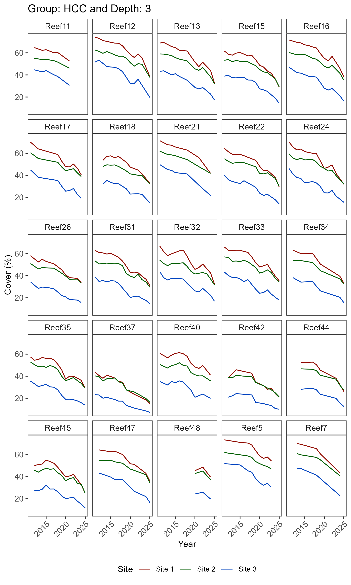
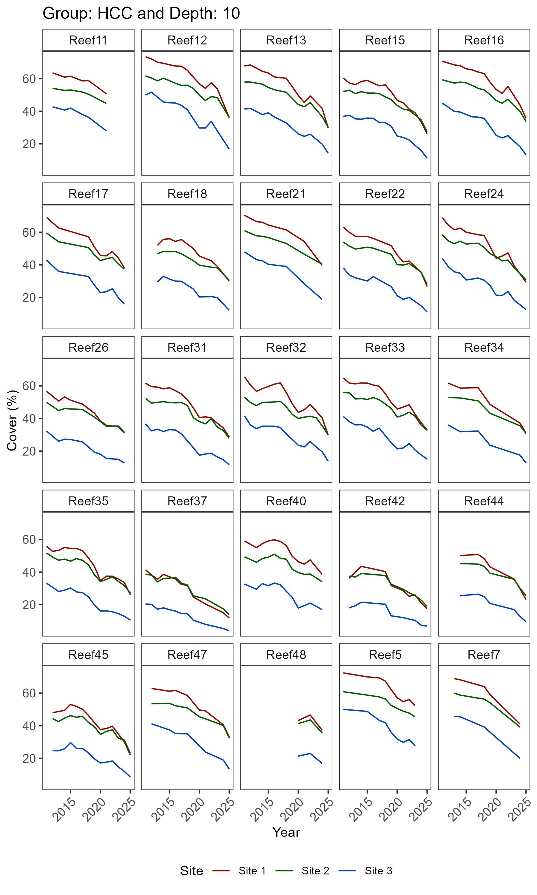
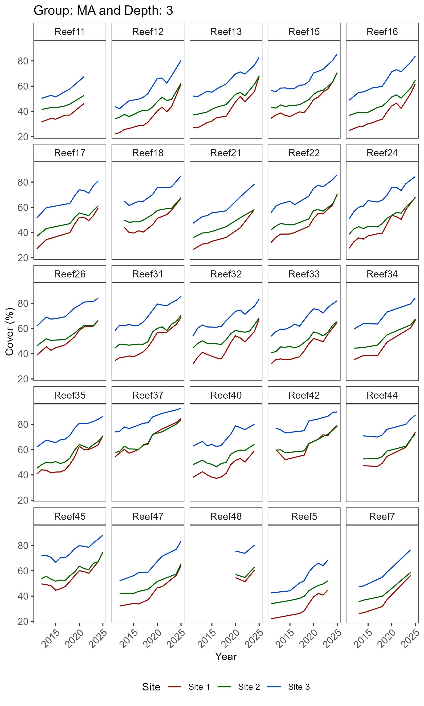
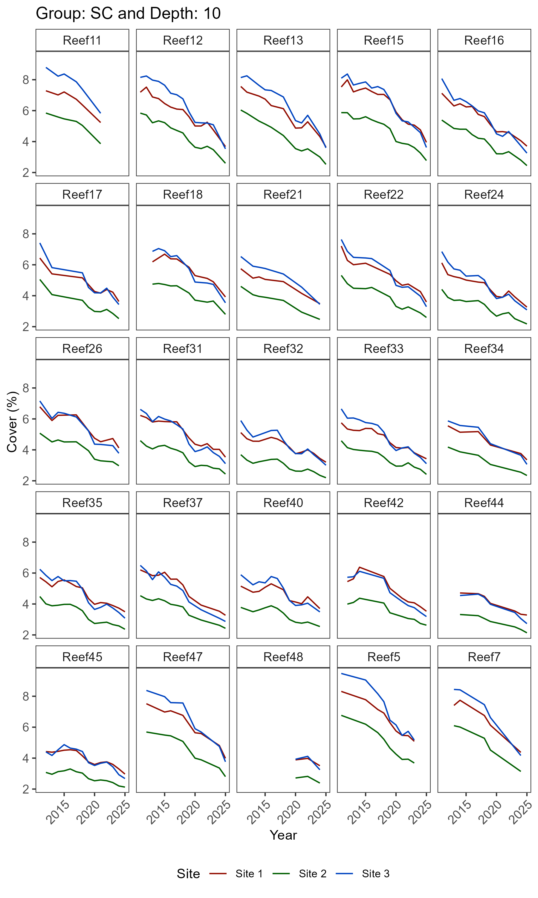
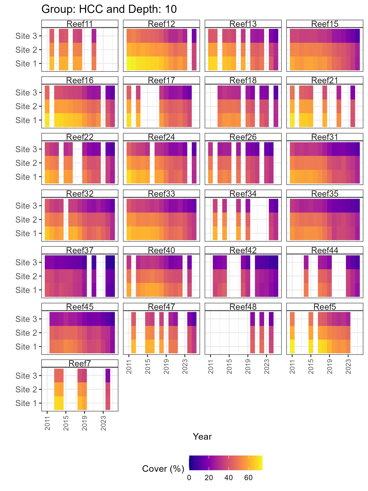
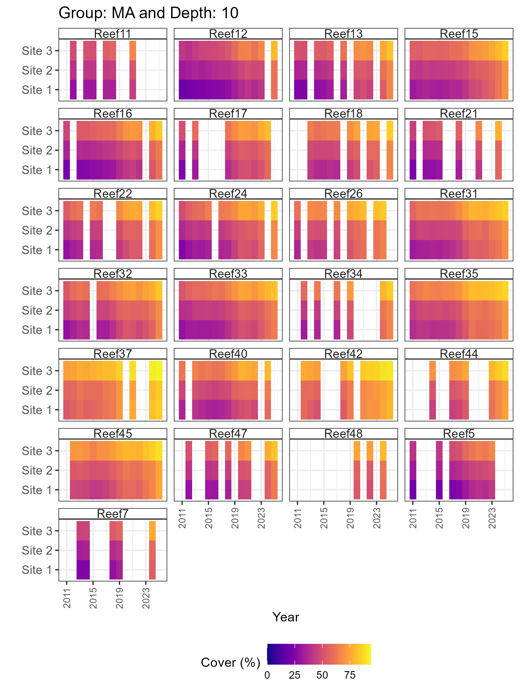
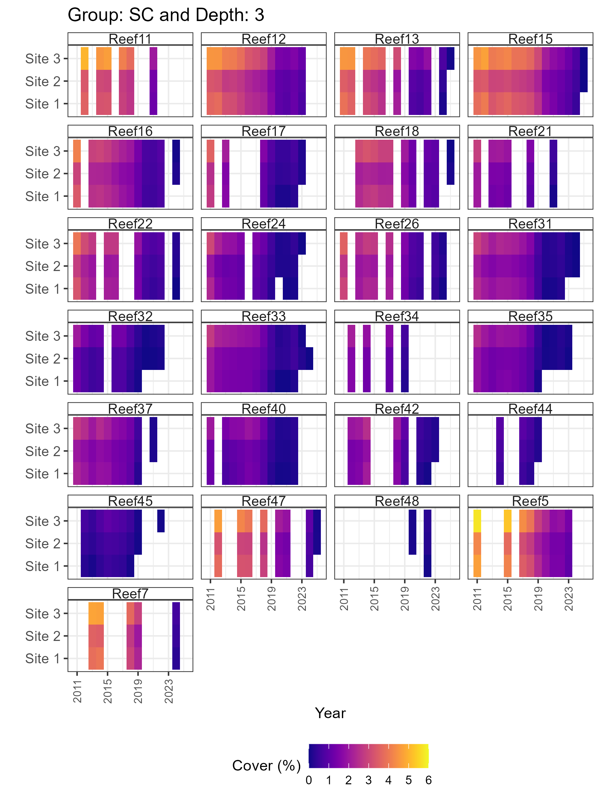

The first version of `synthos` generates semi-realistic data of three benthic communities: hard coral, soft coral and macroalgae. 

This vignette illustrates an example of how to use `synthos` by simulating observations of bentbic communities using the following configuration: 

| Main configuration             |  Example settings                                                                              |
|--------------------------------|------------------------------------------------------------------------------------------------|
| Observation data type          | Point-based observations                                                                       |
| Site allocation                | Random locations                                                                               |
| Number of sampling events      | 15 years                                                                                       |
| Sampling design                | 25 reefs, 3 sites per reef, 5 transects per site, 100 photo frames per transect, 50 points per frame, 2 depths |
| Relative disturbance weights   | 80% heat stress, 19% cyclones, 1% "other" disturbances                                           |
| Annual growth rates            | 3% for hard coral and 3% for soft coral\*                                                    |

The configuration used in this example can be easily adjusted using the function [generateSettings](https://open-aims.github.io/synthos/reference/generateSettings.html). 

Further explanations of each step can be found in the accompanying [vignettes](https://open-aims.github.io/synthos/articles/).

*Macroalgae responds differently: instead of growing independently, it occupies the remaining available space (i.e.,
macroalgae cover = total available space − (hard coral cover + soft coral cover)).

```{r, include = FALSE}
knitr::opts_chunk$set(
  collapse = TRUE,
  comment = "#>"
)
```

## Setting up

```{r setup, message = FALSE, warning = FALSE, eval=FALSE}
# Load packages
library(sf)
library(stars)
library(gstat)
library(INLA)
library(ggplot2)
library(synthos)
```

## 1. Generate settings 

```{r generate-settings, message = FALSE, warning = FALSE, eval=FALSE}
surveys <-  "random" # or "fixed"
data_type <- "points" # or "cover"

synthos::generateSettings(nreefs = 25, nsites = 3, nyears = 15)
```

## 2. Generate the spatio-temporal domain, disturbance effects and baselines

```{r generate-sp, message = FALSE, warning = FALSE, eval=FALSE}
spatial_domain <- st_geometry(
  st_multipoint(
    x = rbind(
      c(0, -11),
      c(3,-11),
      c(6,-14),
      c(1,-15),
      c(2,-12),
      c(0,-11)
    )
  )
) |>
  st_set_crs(config_sp$crs) |>
  st_cast("POLYGON")

## ---- SpatialPoints
set.seed(config_sp$seed)
spatial_grid <- spatial_domain |>
  st_set_crs(NA) |>
  st_sample(size = 10000, type = "regular") |>
  st_set_crs(config_sp$crs)
sf_use_s2(FALSE)

benthos_reefs_pts <- synthos::create_synthetic_reef_landscape(spatial_grid, config_sp)
```

## 3. Generate sampling design

```{r generate-sampling, message = FALSE, warning = FALSE, eval=FALSE}
if (surveys == "fixed") {
  locs_sf <- synthos::sampling_design_large_scale_fixed(
    benthos_reefs_pts, config_lrge
  )
  obs <- synthos::sampling_design_fine_scale_fixed(
    locs_sf, config_fine
  )
  
} else if (surveys == "random") {
  locs_sf <- synthos::sampling_design_large_scale_random(
    benthos_reefs_pts, config_lrge
  )
  obs <- synthos::sampling_design_fine_scale_random(
    locs_sf, config_fine
  )
} else {
  stop("surveys must be 'fixed' or 'random'.")
}
```

## 4. Generate export data table

```{r export, message = FALSE, warning = FALSE, eval=FALSE}
if (data_type == "points") {
  pts <- synthos::sampling_design_fine_scale_points(obs, config_pt)
  synthos_data <- synthos::prepare_table(pts)  
  
} else if (data_type == "cover") {
  cov <- synthos::sampling_design_fine_scale_cover(obs, config_pt)
  synthos_data <- synthos::prepare_table(cov) 
  
} else {
  stop("data_type must be 'points' or 'cover'.")
}
```

## 5. Vizualisations

```{r viz, message = FALSE, warning = FALSE, eval=FALSE}
# 3.1 Long-term trajectories at site level

plots_1 <- synthos::plot_synthos(synthos_data, type = "trajectories")
purrr::walk(seq_along(plots), ~ ggsave(filename = paste0("figures/figure1.", .x, ".png"),
                                plot = plots[[.x]], width = 6, height = 10, dpi = 300))

# 3.2 Heatmaps 
plots_2 <- synthos::plot_synthos(synthos_data, type = "heatmaps")
purrr::walk(seq_along(plots), ~ ggsave(filename = paste0("figures/figure2.", .x, ".png"),
                                plot = plots[[.x]], width = 6, height = 8, dpi = 300))
```

### 5.1 Trajectories 
<!-- <figure style="text-align: center">
  
  <figcaption>Figure 1: Trajectories of hard coral cover (HCC) at 3m depth. </figcaption>
</figure> -->

<figure style="text-align: center">
  
  <figcaption>Figure 2: Trajectories of hard coral cover (HCC) at 10m depth. </figcaption>
</figure>

<!-- <figure style="text-align: center">
  
  <figcaption>Figure 3: Trajectories of macroalgae cover (MA) at 3m depth. </figcaption>
</figure>

<figure style="text-align: center">
  
  <figcaption>Figure 4: Trajectories of macroalgae cover (MA) at 10m depth. </figcaption>
</figure>

<figure style="text-align: center">
  
  <figcaption>Figure 5: Trajectories of soft coral cover (SC) at 3m depth. </figcaption>
</figure>

<figure style="text-align: center">
  
  <figcaption>Figure 6: Trajectories of soft coral cover (SC) at 10m depth. </figcaption>
</figure> -->

### 5.2 Heatmaps 
<!-- <figure style="text-align: center">
  
  <figcaption>Figure 7: Temporal pattern of mean hard coral cover (HCC) by site at 3m depth. </figcaption>
</figure> -->

<figure style="text-align: center">
  
  <figcaption>Figure 8: Temporal pattern of mean hard coral cover (HCC) by site at 10m depth. </figcaption>
</figure>

<!-- <figure style="text-align: center">
  
  <figcaption>Figure 9: Temporal pattern of mean macroalgae cover (MA) by site at 3m depth. </figcaption>
</figure>

<figure style="text-align: center">
  
  <figcaption>Figure 10: Temporal pattern of mean macroalgae cover (MA) by site at 10m depth. </figcaption>
</figure>

<figure style="text-align: center">
  
  <figcaption>Figure 11: Temporal pattern of mean soft coral cover (SC) by site at 3m depth. </figcaption>
</figure>

<figure style="text-align: center">
  
  <figcaption>Figure 12: Temporal pattern of mean soft coral cover (SC) by site at 10m depth. </figcaption>
</figure>
 -->
